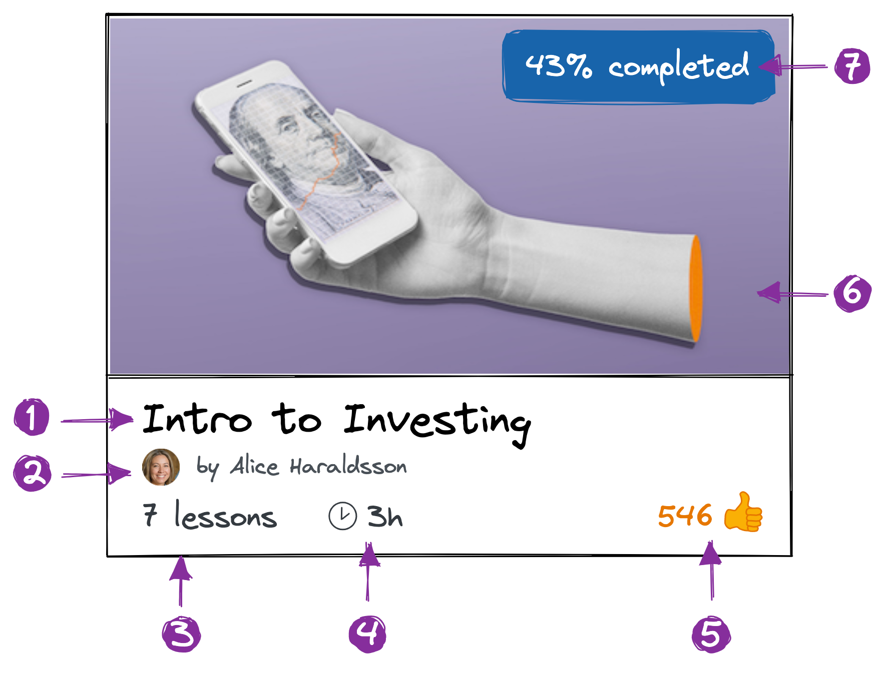
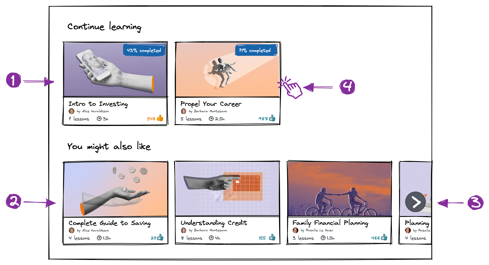

# Full-Stack Engineer Take Home Assignment

For this take-home assignment, we are asking you to write a small web
application implementing the project described below.

The app should:

- Be written in TypeScript.
- Use React for its frontend.
- Use Node.js for its backend.

Other than that, you're free to choose whatever tools and libraries you prefer.

Once you've written the app, you should share with us its source code - in one
way or another.

## The Project

### Context

One of Female Invest's core offering is a Learning Management System (LMS) that
allows Female Invest customers to learn about investing, personal finance, and
other related topics.

Currently, the Female Invest LMS is based on an off-the-shelf product. While
this product has allowed the company in its early stages to quickly deliver a
learning platform to its customers, the product has many limitations and is
starting to hamper Female Invest's ambitions.

For this reason, Female Invest has decided to build a fully-custom, in-house
replacement. Like the current LMS, the new one will be a web application.

### Requirements

Work on the new LMS - codenamed Octopus - has begun. The UX team has produced
and sent you, the developer, the following mockup for the first page of the app.

The mockup shows the courses page, the main page the user lands on when they log
into the LMS.

#### Courses

The **course** is the main entity the LMS: it's a learning program that teaches
the user about a particular subject, for example how to start investing. The
teaching material of the course is split across lessons, and the course itself
has some information attached that describe it. That information is summarized
in the course card shown in the mockup. Let's take a closer look at it.

From the mockup we can identify UI elements displaying various bits of
information:

1. The course title.
2. The course author.
3. The number of lessons in the course.
4. The estimated time of completion for the course. (I.e.: an estimate for how
   long a user will take to go through the course.)
5. The number of _"likes"_ the course has received. This is an interactive UI
   element: the user can click on it to _"like"_ or _"unlike"_ the course. If
   the user has liked the course, the UI element is highlighted (e.g.: it turns
   yellow).
6. The course cover image.
7. The user completion percentage. When a user starts going through a course,
   the LMS tracks the progress of the user and shows in this box the completed
   percentage.

#### Courses Page

Let's also analyze the courses page in more detail.

1. The top half of the page shows a list of courses the user has started, but
   not completed.
2. The bottom half of the page shows a list of courses the user has not started.
3. As Female Invest has a lot of courses in its offering, these lists can be
   infinite-scrolled (horizontally) to load more courses.
4. Clicking on a course directs the user to the _"course player"_ page, where
   they can continue going through the course. The course player page has not
   been mocked-up by the UX team yet, so you don't need to build it for now.

### Your Task

Your task is to implement the courses page shown in the mockup.

#### But It's a Lot of Work!

Even a single page with a couple of simple lists can take a long time to code
properly. First of all you need to set up the frontend, the backend, and the
database. Then you have to model the domain, define an API, implement it, write
tests... If one wanted to make it production-ready, it could easily take a
couple of weeks.

Of course, we don't expect you to work that much! We really value your time, and
we don't want you to spend more than 4 hours on this assignment. However far
along you can get, it's OK, and will serve as a starting point for our live
interview. You can choose to focus just on (certain aspects of) the frontend,
the backend, or even spend all your time on a kick-ass project setup. Your call.

Indeed, _we prefer_ for you to focus on a just few things and do them very well,
so you can show us your skill ceiling.

### Evaluation criteria

The scope of the task is broad and our evaluation criteria vary based on what
part of the task you chose to focus on. To give you an idea, here's a
non-exhaustive and randomly-sorted list of questions we'll ask ourselves when
reviewing your assignment.

- Frontend:
  - How are components organized? How are responsibilities split among them? Do
    components have a clear API?
  - What state management patterns are used?
  - How is styling managed?
- Backend:
  - How are the entities and operations exposed by the API modelled? Is the API
    documented?
  - Does the backend follow some architectural pattern? How are responsibilities
    split among the various parts of the codebase?
  - How is the database structured? How is it accessed?
- General:
  - Is naming consistent throughout the project? How about files and folders
    structure?
  - Are things tested? How?

Again, we don't expect your solution to be perfect on all the above aspects. On
the contrary. It's completely normal if, for example, you tell us _"I just
implemented the frontend, and even there I just phoned-in styling and put all my
effort on state management and testing"_.
